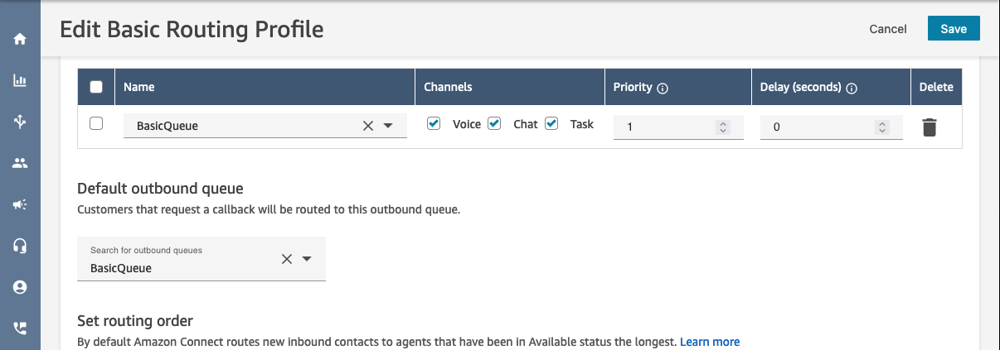
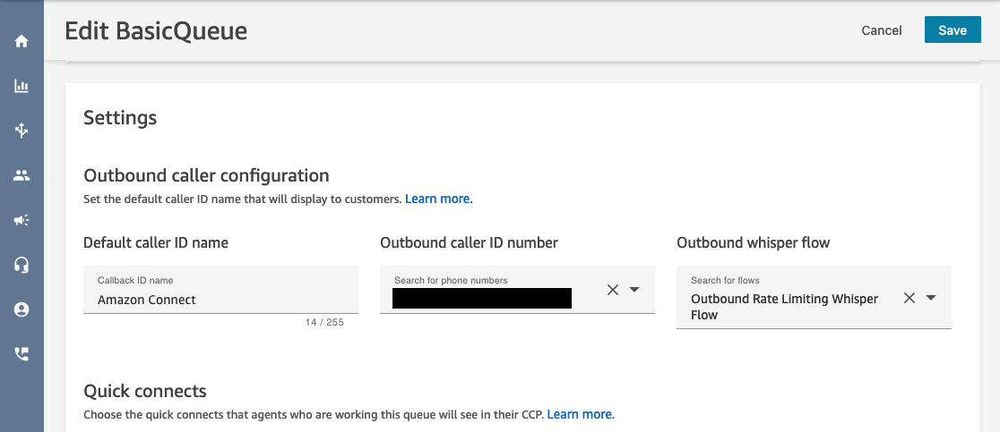
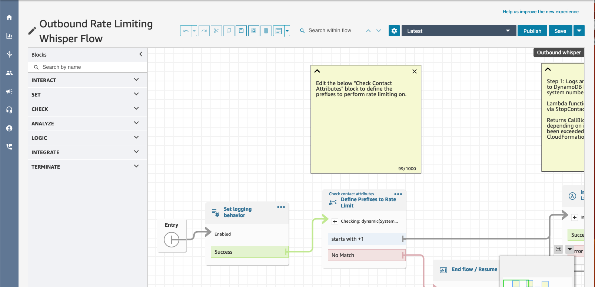

# Amazon Connect Outbound Rate Limiting

This repository contains an example of how to implement an outbound rate limting pattern with Amazon Connect. To comply with [various telephony regulations](https://docs.aws.amazon.com/connect/latest/adminguide/outbound-calling-restrictions.html), organizations performing larger volumes of outbound calling must implemement patterns to prevent repeat calls to customer endpoints, and from the same outbound caller ID.

Using an Outbound Whisper Flow, this CDK project tracks rates of outbound calls to customer endpoints and from system endpoints, and will initiate a [StopContact](https://docs.aws.amazon.com/connect/latest/APIReference/API_StopContact.html) request if a call exceeds a predefined rate limit. To inform agents of what has happened, it will send a [Task](https://aws.amazon.com/connect/tasks/) to their agent queue informing them that the call has been blocked, and to try again later.

## Deploying the CDK Stack

Set up CDK as described [here](https://docs.aws.amazon.com/cdk/v2/guide/getting_started.html). Then, use the following commands to install all dependencies and deploy the stack in your AWS account:

```
npm install

cdk deploy \
--parameters ConnectInstanceARN=<Your Connect Instance ARN> \
--parameters CustomerRateLimit=5 \
--parameters SystemRateLimit=10
```

For parameters, `CustomerRateLimit` is the number of calls per minute that would be allowed to a customer number. Any calls equal to or over this amount are blocked for all agents. For `SystemRateLimit`, this would be the amount of calls per minute to any number from a Connect-managed system number.

> **Note:** Calls per minute is counted as attempts and will reset the minute timer on every attempt made. If calls are blocked, all agents will be required to stop calling from or to a phone number for the next minute for the rate limit to be reset.

## Configuring the Amazon Connect Instance

After deploying, the CDK stack will deploy resources to your AWS Account and Amazon Connect Instance.

The first flow that will be deployed is the `Outbound Rate Limiting Whisper Flow`. This flow should be used on any call paths that make outbound calls to customers from an agent. To ensure this flow is used, agent's routing profiles should be configured to use a queue that has the above whisper flow in the Outbound caller configuration, seen in the below screenshots.



Inside of the outbound whisper flow, you can use a [Check Contact Attributes](https://docs.aws.amazon.com/connect/latest/adminguide/check-contact-attributes.html) block to decide what contacts to rate limit. In this example, contacts are only set to be rate limited on the `+1` country code prefix. Check contact attributes supports string matching, contains, starts with and ends with, so multiple prefixes and phone numbers could be added. Edit and republish the contact flow to modify this experience.



The second flow that is deployed is the `Rate Limit Warning to Agent Flow`. This flow routes contacts directly to an agent queue. In this example, an agent is routed a Task informing them the contact has been blocked, and to try again later. If you desire a different experience, you can modify this flow to implement that.

## Testing Rate Limiting

After the CDK Stack has been deployed and the experience has been configured, you can test this by opening the [Amazon Connect Contact Control Panel](https://docs.aws.amazon.com/connect/latest/adminguide/launch-ccp.html). As an agent with the above Outbound Whisper Flow configured, make repeated calls to or from a caller ID in excess of the rate limits defined above.